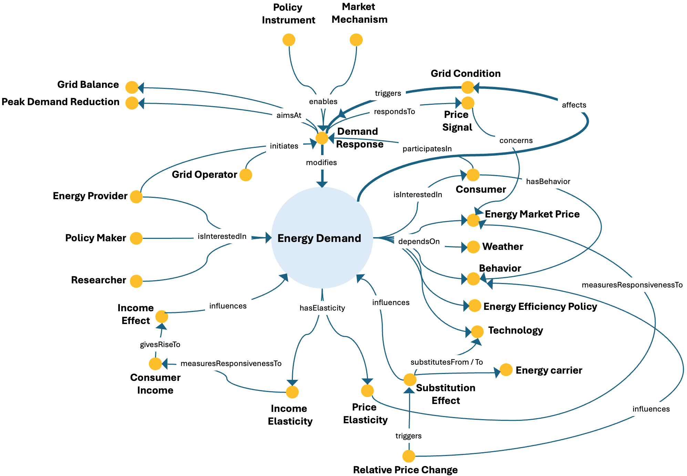

# Energy Demand ODP

## Description

The Energy Demand Ontology Design Pattern represents energy demand as a service request and an energy process shaped by behavioural, technological, environmental, policy, and economic factors. It connects demand with consumer behaviour, market prices, weather conditions, energy-efficiency policies, technologies, and the economic mechanisms through which consumers respond to changes in income and relative prices.

The pattern also describes demand response as an operational strategy through which energy providers and grid operators encourage consumers to adjust their energy use in response to price signals or grid conditions. Demand response can modify energy demand and contribute to objectives such as grid balance and peak-demand reduction.

By connecting consumers, market signals, policy instruments, grid conditions, elasticities, and substitution mechanisms, the pattern supports a structured analysis of how energy demand changes and how it can be managed within an energy system.

---

## Conceptual Diagram

---

## Key Concepts

### Core concepts

- **`energy_demand`**: A demand for energy. In ESO, it is modeled both as a `Service_request` and as an `energy_process`.
- **`demand_response`**: A strategy used by energy providers and grid operators to manage electricity demand during periods of peak consumption or supply constraints. It encourages consumers to adjust their electricity use in response to price signals or grid conditions.
- **`consumer`**: An actor who uses goods or services and whose behaviour, income, and response to prices affect energy-demand dynamics.

### Demand drivers and market signals

- **`behavior`**: The way in which a consumer acts; in this pattern, it represents behavioural characteristics associated with energy consumption.
- **`weather`**: Short-term atmospheric conditions—including temperature, humidity, precipitation, wind, and cloud cover—that can affect energy use.
- **`technology`**: Information specifying how an artificial object is created; technologies can affect the way energy is consumed and the efficiency of energy services.
- **`energy_efficiency_policy`**: Regulations, incentives, and initiatives intended to improve energy efficiency across economic sectors.
- **`energy_market_price`**: The market value or cost of buying or selling energy resources at a given time, shaped by supply and demand, production costs, policy, and other market conditions.
- **`price_signal`**: A signal conveyed through prices, tariffs, or market incentives that can induce consumers or other market actors to change their energy use.
- **`grid_condition`**: An operational state of the electricity grid that may affect reliability, supply–demand balance, congestion, or the need for demand-side adjustment.

### Elasticities and economic effects

- **`income_elasticity`**: A measure of the responsiveness of energy demand to changes in consumer income.
- **`price_elasticity`**: A measure of the responsiveness of demand to changes in the price of a product or service.
- **`consumer_income`**: The income or economic resources available to a consumer, affecting purchasing capacity and energy demand.
- **`income_effect`**: The change in energy demand associated with a change in consumers’ purchasing power.
- **`substitution_effect`**: A demand-side economic mechanism through which consumers shift demand from a relatively more expensive or less attractive energy carrier or technology to an alternative.
- **`relative_price_change`**: A change in the price relationship between energy carriers, technologies, or services that may alter their relative attractiveness to consumers.

### Actors, instruments, and objectives

- **`energy_provider`**: An entity responsible for supplying or distributing energy to consumers and businesses.
- **`grid_operator`**: An actor responsible for operating and coordinating an electricity grid, including grid balance, reliability, and operational security.
- **`policy-maker`**: An actor who develops or implements public policies and may use policy instruments to influence energy demand and demand response.
- **`researcher`**: An actor who investigates energy-demand dynamics and produces new knowledge about the energy system.
- **`policy_instrument`**: A tool or mechanism used by policymakers to implement or support a policy intervention.
- **`market_mechanism`**: A mechanism or market force that helps determine the price and availability of goods and services.
- **`grid_balance`**: The operational alignment of electricity supply and demand required for stable and reliable grid operation.
- **`peak_demand_reduction`**: The objective of lowering electricity demand during periods of maximum load.

---

## Main Relationships

| Source concept | Relationship | Target concept |
|---|---|---|
| `energy_demand` | `dependsOn` | `behavior`, `energy_efficiency_policy`, `technology`, `weather` |
| `energy_demand` | `hasElasticity` | `income_elasticity`, `price_elasticity` |
| `energy_demand` | `influences` / `determines` | `energy_market_price` |
| `energy_demand` | `affects` | `grid_condition` |
| `energy_demand` | `isInterestedIn` | `consumer` |
| `demand_response` | `modifies` | `energy_demand` |
| `demand_response` | `respondsTo` | `price_signal` |
| `demand_response` | `aimsAt` | `grid_balance`, `peak_demand_reduction` |
| `income_effect` | `influences` | `energy_demand` |
| `substitution_effect` | `influences` | `energy_demand` |
| `substitution_effect` | `substitutesFrom` / `substitutesTo` | `energy_carrier`, `technology` |
| `income_elasticity` | `measuresResponsivenessTo` | `consumer_income` |
| `energy_provider`, `policy-maker`, `researcher` | `isInterestedIn` | `energy_demand` |

---

## Interpretation

The pattern combines three complementary perspectives. First, it represents the factors associated with energy demand, including behaviour, weather, technology, efficiency policy, and market conditions. Second, it models economic responsiveness through income elasticity, price elasticity, income effects, and substitution effects. Third, it represents demand response as an intervention that modifies demand in response to market and grid signals and contributes to grid-management objectives.

This structure makes the pattern suitable for competency questions concerning the factors that shape demand, the responsiveness of consumers to income and price changes, the actors interested in demand dynamics, and the mechanisms used to manage peak consumption and grid balance.

> **Modeling note:** In ESO version 1.05, the formal OWL axioms also state that `energy_demand dependsOn population`, although `population` is not shown in the current conceptual diagram. The ontology also represents the connection from `energy_demand` to `energy_market_price` through `influences` and `determines`; the table above follows those formal axioms.

---

⬅️ [Back to the ODP Catalog](./)

