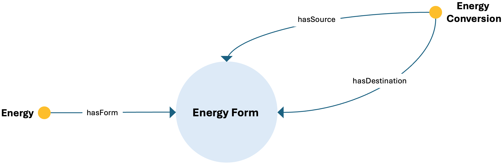

# Energy Form ODP

## Description
The Energy Form Ontology Design Pattern captures the different forms that energy can assume and the processes through which one form of energy is converted into another.

This pattern provides a structured semantic representation that can be reused across the ESO catalog and linked to other patterns when modeling more complex energy-system dynamics.

---

## Conceptual Diagram


---

## Formal OWL Excerpt

```turtle
@prefix eso:  <http://jerico.casaccia.enea.it/genesys/Energy-System-Ontology_v1.01#> .
@prefix owl:  <http://www.w3.org/2002/07/owl#> .
@prefix rdfs: <http://www.w3.org/2000/01/rdf-schema#> .

eso:energy_form a owl:Class ;
    rdfs:label "energy_form" .

eso:energy_conversion a owl:Class ;
    rdfs:label "energy_conversion" ;
    rdfs:subClassOf eso:system_internal_operation ;
    rdfs:subClassOf [ a owl:Restriction ; owl:onProperty eso:hasSource ; owl:someValuesFrom eso:energy_form ] ;
    rdfs:subClassOf [ a owl:Restriction ; owl:onProperty eso:hasDestination ; owl:someValuesFrom eso:energy_form ] .

eso:energy a owl:Class ;
    rdfs:label "energy" ;
    rdfs:subClassOf [ a owl:Restriction ; owl:onProperty eso:hasForm ; owl:someValuesFrom eso:energy_form ] .
```

---

## Related Classes and Properties

```turtle
@prefix eso:  <http://jerico.casaccia.enea.it/genesys/Energy-System-Ontology_v1.01#> .
@prefix owl:  <http://www.w3.org/2002/07/owl#> .
@prefix rdfs: <http://www.w3.org/2000/01/rdf-schema#> .

eso:energy a owl:Class .
eso:energy_form a owl:Class .
eso:energy_conversion a owl:Class .
eso:system_internal_operation a owl:Class .

eso:hasForm a owl:ObjectProperty .
eso:hasSource a owl:ObjectProperty .
eso:hasDestination a owl:ObjectProperty .
```

---

## Key Concepts

- **energy_form**: It represents a specific form in which energy can exist.
- **energy_conversion**: It represents a process that transforms one energy form into another.
- **energy**: It represents energy as an entity associated with one or more forms.

---

## Interpretation
The pattern represents energy as something that can appear in multiple forms and be transformed through internal system operations. It is especially useful for modeling conversion chains and technology-dependent transformations.

---

## Download
- [TTL file](../assets/rdf/energy-form.ttl)
