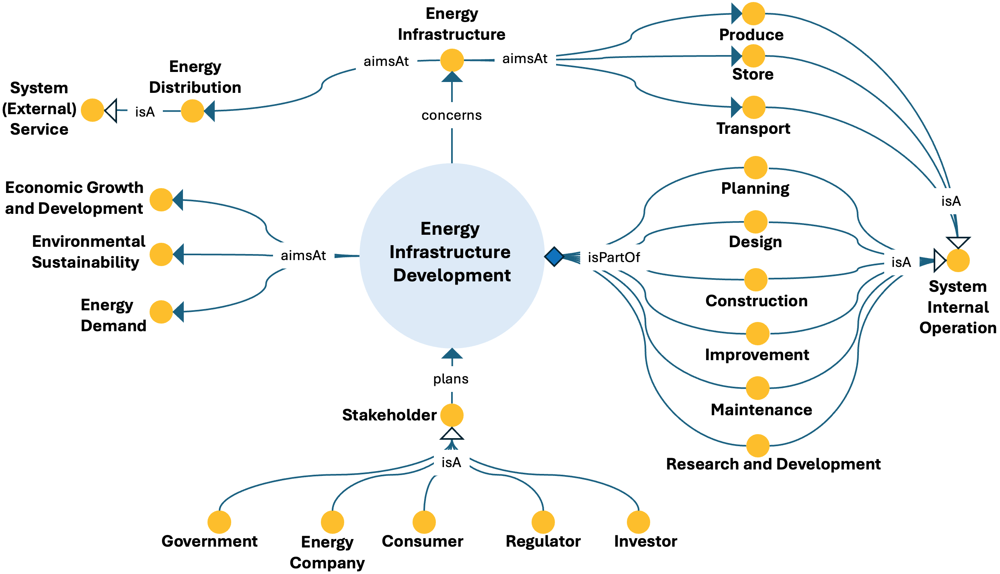

# Energy Infrastructure Development ODP

## Description
The Energy Infrastructure Development Ontology Design Pattern models the planning and development of infrastructures that enable energy production, transport, storage, and distribution. It also connects infrastructure development to demand requirements, sustainability objectives, and stakeholder planning activities.

This pattern provides a structured semantic representation that can be reused across the ESO catalog and linked to other patterns when modeling more complex energy-system dynamics.

---

## Conceptual Diagram

---

## Key Concepts

- **energy_infrastructure_development**: It represents planning and development processes concerning energy infrastructures.
- **energy_infrastructure**: It represents infrastructure assets that support production, storage, transport, and distribution.
- **stakeholder**: It represents actors involved in planning and directing infrastructure development.
- **environmental_sustainability**: It represents a key objective linked to infrastructure development.

---

## Interpretation
The pattern links physical infrastructures to energy demand, sustainability, and broader development objectives. It also highlights the role of stakeholders in planning and guiding infrastructure development.

---

⬅️ [Back to the ODP Catalog](./)

