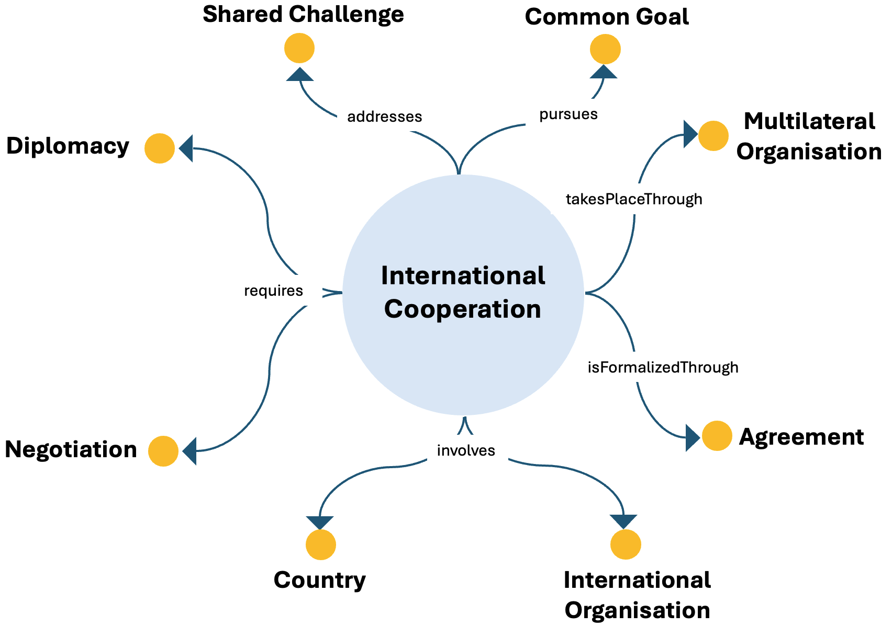

# International Cooperation ODP

## Description
The International Cooperation Ontology Design Pattern represents cooperative interactions among countries and international organizations aimed at addressing shared challenges and pursuing common energy-related goals.

This pattern provides a structured semantic representation that can be reused across the ESO catalog and linked to other patterns when modeling more complex energy-system dynamics.

---

## Conceptual Diagram

---

## Key Concepts

- **international_cooperation**: It represents cooperation processes among countries and organizations.
- **diplomacy**: It represents one of the enabling processes of cooperation.
- **negotiation**: It represents another enabling process of cooperation.
- **agreement**: It represents formal arrangements associated with cooperation.
- **shared_challenge**: It represents the challenge being jointly addressed.

---

## Interpretation
The pattern models international cooperation as a structured process involving multiple actors, formal arrangements, and shared objectives. It is useful for representing geopolitical and governance dimensions of energy transition.

---
