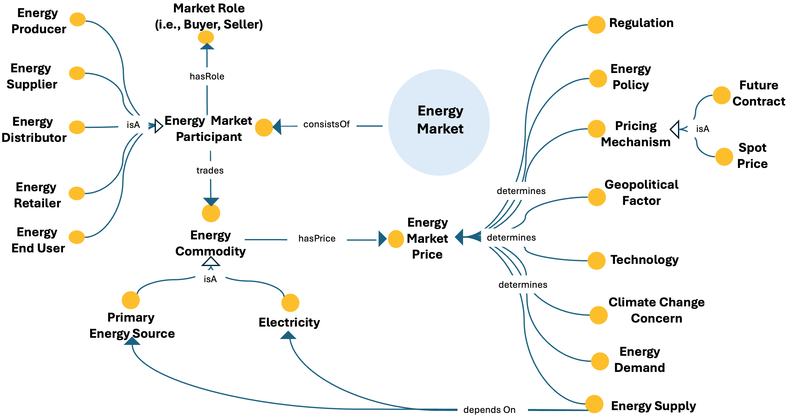

# Energy Market ODP

## Description
The Energy Market Ontology Design Pattern represents the interaction of market participants that trade energy commodities. It captures roles, market prices, supply and demand dynamics, and the influence of regulatory and pricing mechanisms.

This pattern provides a structured semantic representation that can be reused across the ESO catalog and linked to other patterns when modeling more complex energy-system dynamics.

---

## Conceptual Diagram


---

## Formal OWL Excerpt

```turtle
@prefix eso:  <http://jerico.casaccia.enea.it/genesys/Energy-System-Ontology_v1.01#> .
@prefix owl:  <http://www.w3.org/2002/07/owl#> .
@prefix rdfs: <http://www.w3.org/2000/01/rdf-schema#> .

eso:energy_market a owl:Class ;
    rdfs:label "energy_market" ;
    rdfs:subClassOf eso:market ;
    rdfs:subClassOf [ a owl:Restriction ; owl:onProperty eso:consistsOf ; owl:someValuesFrom eso:energy_market_participant ] ;
    rdfs:subClassOf [ a owl:Restriction ; owl:onProperty eso:related_To ; owl:someValuesFrom eso:agent_behaviour_subsystem ] .

eso:energy_market_participant a owl:Class ;
    rdfs:subClassOf [ a owl:Restriction ; owl:onProperty eso:trades ; owl:someValuesFrom eso:energy_commodity ] ;
    rdfs:subClassOf [ a owl:Restriction ; owl:onProperty eso:hasRole ; owl:someValuesFrom eso:market_role ] .

eso:energy_commodity a owl:Class ;
    rdfs:subClassOf [ a owl:Restriction ; owl:onProperty eso:hasPrice ; owl:someValuesFrom eso:energy_market_price ] .

eso:regulation a owl:Class ;
    rdfs:subClassOf [ a owl:Restriction ; owl:onProperty eso:determines ; owl:someValuesFrom eso:energy_market_price ] .

eso:energy_policy a owl:Class ;
    rdfs:subClassOf [ a owl:Restriction ; owl:onProperty eso:determines ; owl:someValuesFrom eso:energy_market_price ] .

eso:pricing_mechanism a owl:Class ;
    rdfs:subClassOf [ a owl:Restriction ; owl:onProperty eso:determines ; owl:someValuesFrom eso:energy_market_price ] .

eso:geopolitical_factor a owl:Class ;
    rdfs:subClassOf [ a owl:Restriction ; owl:onProperty eso:determines ; owl:someValuesFrom eso:energy_market_price ] .

eso:technology a owl:Class ;
    rdfs:subClassOf [ a owl:Restriction ; owl:onProperty eso:determines ; owl:someValuesFrom eso:energy_market_price ] .

eso:climate_change_concern a owl:Class ;
    rdfs:subClassOf [ a owl:Restriction ; owl:onProperty eso:determines ; owl:someValuesFrom eso:energy_market_price ] .

eso:energy_demand a owl:Class ;
    rdfs:subClassOf [ a owl:Restriction ; owl:onProperty eso:determines ; owl:someValuesFrom eso:energy_market_price ] .

eso:energy_supply a owl:Class ;
    rdfs:subClassOf [ a owl:Restriction ; owl:onProperty eso:determines ; owl:someValuesFrom eso:energy_market_price ] .

```

---

## Related Classes and Properties

```turtle
@prefix eso:  <http://jerico.casaccia.enea.it/genesys/Energy-System-Ontology_v1.01#> .
@prefix owl:  <http://www.w3.org/2002/07/owl#> .
@prefix rdfs: <http://www.w3.org/2000/01/rdf-schema#> .

eso:energy_market a owl:Class .
eso:energy_market_participant a owl:Class .
eso:energy_commodity a owl:Class .
eso:market_role a owl:Class .
eso:energy_market_price a owl:Class .
eso:regulation a owl:Class .
eso:energy_policy a owl:Class .
eso:pricing_mechanism a owl:Class .
eso:geopolitical_factor a owl:Class .
eso:technology a owl:Class .
eso:climate_change_concern a owl:Class .
eso:energy_demand a owl:Class .
eso:energy_supply a owl:Class .
eso:primary_energy_source a owl:Class .
eso:electricity a owl:Class .

eso:consistsOf a owl:ObjectProperty .
eso:related_To a owl:ObjectProperty .
eso:trades a owl:ObjectProperty .
eso:hasRole a owl:ObjectProperty .
eso:determines a owl:ObjectProperty .
eso:dependsOn a owl:ObjectProperty .
```

---

## Key Concepts

- **energy_market**: It represents the market context in which energy commodities are exchanged.
- **energy_market_participant**: It represents actors involved in trading energy commodities.
- **market_role**: It represents the role assumed by a market participant.
- **energy_market_price**: It represents price formation in the market as determined by multiple factors.

---

## Interpretation
This pattern structures market participation around trading activities, roles, and price formation. It supports integrated analysis of the economic and behavioural dimensions of energy systems.

---

## Download
- [TTL file](../assets/rdf/energy-market.ttl)
