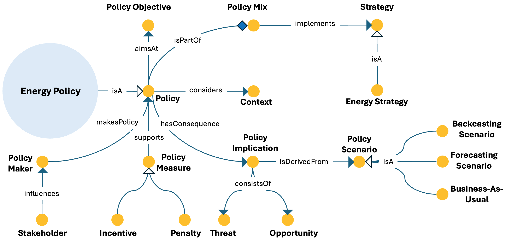

# Energy Policy ODP

## Description
The Energy Policy Ontology Design Pattern models energy policies as regulatory instruments connected to objectives, contextual factors, policy measures, policy mixes, stakeholders, and possible consequences.

This pattern provides a structured semantic representation that can be reused across the ESO catalog and linked to other patterns when modeling more complex energy-system dynamics.

---

## Conceptual Diagram

---

## Key Concepts

- **energy_policy**: Represents a policy instrument in the energy domain.
- **policy_objective**: Represents the target or goal pursued by a policy.
- **policy_mix**: Represents a broader set of coordinated policy instruments.
- **policy_measure**: Represents support measures associated with policy implementation.
- **policy_implication**: Represents possible consequences or outcomes of a policy.

---

## Interpretation
The pattern represents energy policy as more than a standalone regulation. It embeds policy in a wider context of strategy, support measures, and implications, enabling richer policy-oriented knowledge representation.

