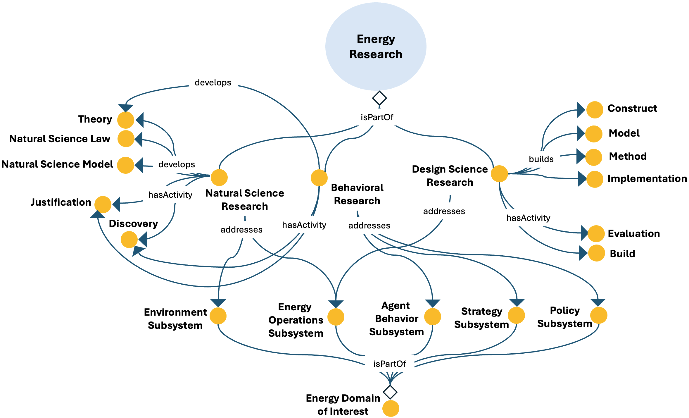

# Energy Research ODP

## Description
The Energy Research Ontology Design Pattern represents research activities related to the energy domain, including natural science, behavioural science, and design science contributions [1, 2].

This pattern provides a structured semantic representation that can be reused across the ESO catalog and linked to other patterns when modeling more complex energy-system dynamics.

---

## Conceptual Diagram

---

## Key Concepts

- **energy_research**: It represents research activities in the energy domain.
- **natural_science_research**: It represents research focused on environmental and operational subsystems.
- **design_science_research**: It represents artifact-oriented research addressing operational subsystems.
- **behavioral_research**: It represents research addressing behavioural, strategic, or policy subsystems.

---

## Interpretation
The pattern provides a structured way to represent research diversity in the energy domain, connecting methodological traditions with the subsystems they address and the outputs they generate.

---

## References
[1] A. R. Hevner, S. T. March, J. Park, S. Ram, Design science in information systems research, MIS Quarterly: Management Information Systems 28 (1) (2004) 75 – 105. doi:10.2307/25148625.

[2] S. T. March, A. R. Hevner, Design and natural science research on information technology, Decision Support Systems, 15 (4), pp. 251 - 266 (1995) 251 - 266. doi:10.1016/0167-9236(94)00041-2. 

