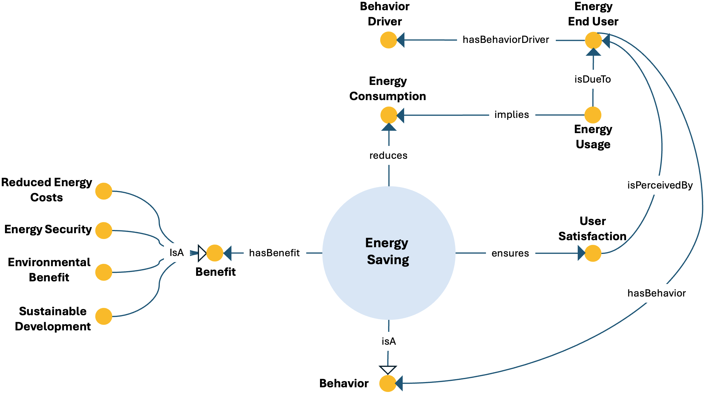

# Energy Saving ODP

## Description

The Energy Saving Ontology Design Pattern represents energy saving as a behaviour through which less energy is used to provide the same output or desired service. It connects this behaviour with reduced energy consumption, user satisfaction, the end user, and the factors that drive user behaviour.

The pattern treats energy saving as a socio-technical phenomenon rather than only as a technical efficiency result. Energy usage is attributed to an energy end user and implies energy consumption, while energy-saving behaviour reduces that consumption. At the same time, the pattern requires the preservation of user satisfaction and represents that satisfaction as perceived by the end user.

Energy saving can generate several kinds of benefit, including reduced energy costs, energy security, environmental benefits, and sustainable development. The pattern therefore supports integrated representations of behavioural change, demand reduction, user experience, and wider energy-system outcomes. 

---

## Conceptual Diagram

---

## Key Concepts

### Core concepts

- **`energy-saving`**: A behaviour, also associated with energy conservation or energy efficiency, through which less energy is used to obtain the same output or desired service. Its ontology label is `energy_saving`.
- **`energy_consumption`**: The amount of energy used by individuals, communities, industries, or countries to perform activities and meet energy needs.
- **`energy_usage`**: A service request and energy process representing energy used to satisfy needs or perform activities. It implies energy consumption and is due to an energy end user.

### Users and behaviour

- **`energy_end_user`**: An individual, household, business, or organization that consumes energy for heating, cooling, lighting, transport, industrial processes, or other activities.
- **`behavior`**: A way of acting or making choices. Energy saving is modeled as a specialization of behaviour.
- **`behavior_driver`**: An internal or external factor that influences or motivates an individual to act or make a particular choice.
- **`user_satisfaction`**: The contentment or positive experience perceived by an end user when a product, service, or system meets expectations and needs.

### Benefits

- **`benefit`**: A positive outcome, advantage, or gain arising from an action or situation.
- **`reduced_energy_costs`**: Lower expenditure on energy resulting from efficiency, technology, renewable energy, or changed consumption patterns.
- **`energy_security`**: The condition of having a reliable and sufficient energy supply to meet the needs of a country, region, or community.
- **`environmental_benefit`**: A positive environmental outcome arising from actions, policies, practices, or technologies that protect ecosystems and natural resources.
- **`sustainable_development`**: Development that meets present needs without compromising the ability of future generations to meet their own needs.

---

## Main Relationships

| Source concept | Relationship | Target concept |
|---|---|---|
| `energy-saving` | `isA` | `behavior` |
| `energy-saving` | `isA` | `sustainable_and_environmental_behavior` |
| `energy-saving` | `reduces` | `energy_consumption` |
| `energy-saving` | `ensures` | `user_satisfaction` |
| `energy-saving` | `hasBenefit` | `benefit` |
| `energy_usage` | `implies` | `energy_consumption` |
| `energy_usage` | `isDueTo` | `energy_end_user` |
| `energy_end_user` | `hasBehavior` | `behavior` |
| `energy_end_user` | `hasBehaviorDriver` | `behavior_driver` |
| `user_satisfaction` | `isPerceivedBy` | `energy_end_user` |
| `reduced_energy_costs` | `isA` | `benefit` |
| `energy_security` | `isA` | `benefit` |
| `environmental_benefit` | `isA` | `benefit` |
| `sustainable_development` | `isA` | `benefit` |

---

## Interpretation

The pattern combines three complementary perspectives. First, it represents the causal connection between usage, consumption, and saving: energy usage implies consumption, while energy-saving behaviour reduces it. Second, it models the user perspective by connecting end users with behaviour drivers, behaviour, and perceived satisfaction. Third, it captures broader outcomes by associating energy saving with economic, security, environmental, and sustainable-development benefits.

The `ensures user_satisfaction` relation expresses an important constraint: a reduction in energy consumption should continue to meet the user’s needs or desired service level. This distinguishes energy saving from a simple loss of service and makes the pattern suitable for competency questions concerning demand-side behaviour, consumption reduction, user acceptance, and the benefits generated by energy-saving practices.

> **Modeling note:** The `hasBehaviorDriver` restriction is declared for the more general class `actor`. It applies to `energy_end_user` through its class hierarchy, since an energy end user is modeled as a consumer and therefore as an actor.

---

⬅️ [Back to the ODP Catalog](./)

