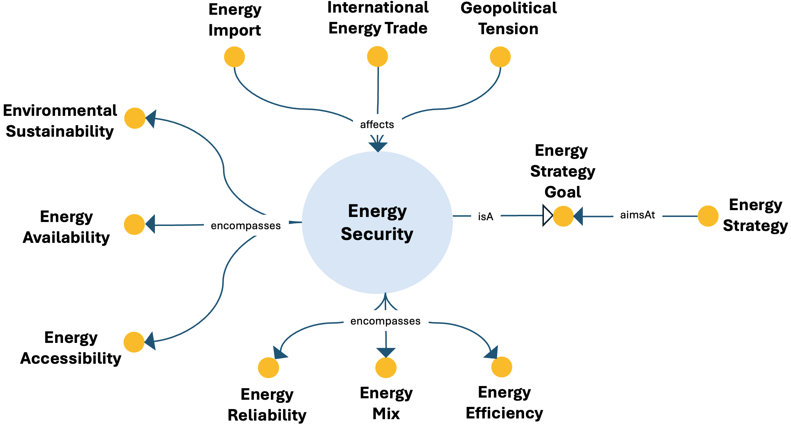

# Energy Security ODP

## Description
The Energy Security Ontology Design Pattern models energy security as a strategic objective associated with accessibility, availability, reliability, efficiency, sustainability, and the energy mix.

This pattern provides a structured semantic representation that can be reused across the ESO catalog and linked to other patterns when modeling more complex energy-system dynamics.

---

## Conceptual Diagram

---

## Key Concepts

- **energy_security**: It represents a strategic objective concerning secure energy provision.
- **energy_accessibility**: It represents access-related aspects of security.
- **energy_availability**: It represents availability-related aspects of security.
- **energy_reliability**: It represents reliability-related aspects of security.
- **energy_mix**: It represents diversity and composition of energy sources.

---

## Interpretation
The pattern formalizes energy security as a multi-dimensional goal rather than a single attribute. It helps represent strategic planning concerns and their links to availability, resilience, and sustainability.

---

⬅️ [Back to the ODP Catalog](./)

