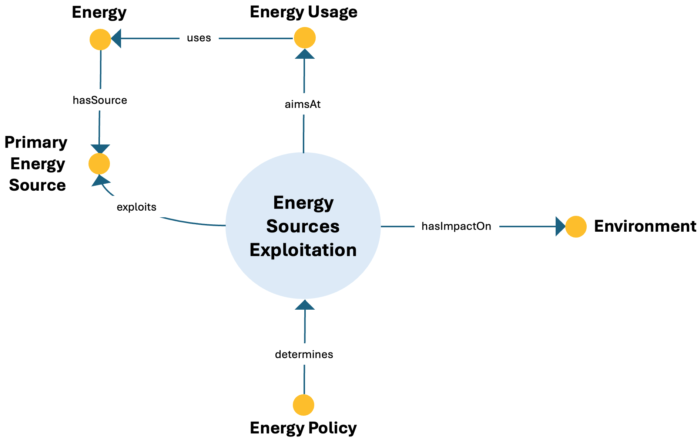

# Energy Sources Exploitation ODP

## Description
The Energy Sources Exploitation Ontology Design Pattern models the use of primary energy sources for specific energy uses, including the influence of policy choices and the environmental consequences of exploitation.

This pattern provides a structured semantic representation that can be reused across the ESO catalog and linked to other patterns when modeling more complex energy-system dynamics.

---

## Conceptual Diagram

---

## Key Concepts

- **energy_sources_exploitation**: It represents processes that exploit primary energy sources.
- **primary_energy_source**: It represents the source being exploited.
- **energy_usage**: It represents the intended use of energy obtained through exploitation.
- **environment**: It represents the environmental domain affected by exploitation.

---

## Interpretation
This pattern links resource exploitation to energy use and environmental impact, showing how primary sources, policies, and usage practices are structurally connected.
