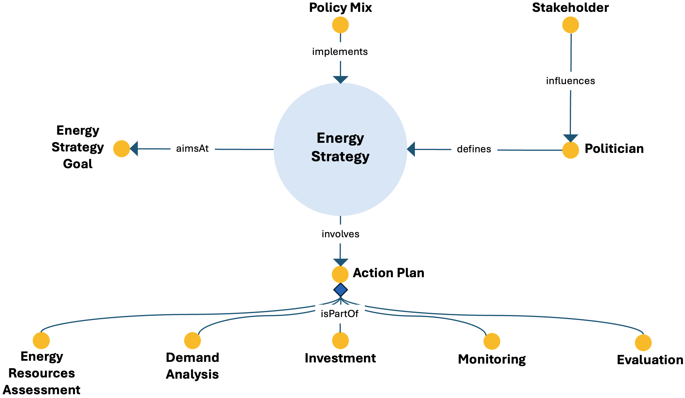

# Energy Strategy Definition ODP

## Description

The Energy Strategy Definition Ontology Design Pattern represents an energy strategy as a comprehensive and integrated plan of action that guides energy-related decisions and activities. It connects the strategy to the goal it aims to achieve, the action plan through which it is operationalized, and the policy mix that implements it.

The pattern also captures the governance dimension of strategy formulation. A politician defines the energy strategy and may be influenced by stakeholders, while the strategy brings together analytical, financial, monitoring, and evaluation activities within an action plan.

By linking strategic goals, political actors, policy instruments, resource assessment, demand analysis, investment, monitoring, and evaluation, the pattern supports a structured representation of how an energy strategy is formulated, implemented, and reviewed.

---

## Conceptual Diagram

---

## Key Concepts

### Core strategic concepts

- **`energy_strategy`**: A comprehensive and integrated plan of action developed by a government, organization, or business to guide energy-related decisions and activities. In ESO, it is modeled as a specialization of `strategy`.
- **`energy_strategy_goal`**: A targeted objective pursued by an energy strategy, such as increasing renewable-energy use, improving energy efficiency, reducing emissions, strengthening energy security, or supporting sustainable development.
- **`action_plan`**: A structured and detailed outline of the steps and activities required to achieve a goal or objective; it operationalizes the energy strategy.
- **`policy_mix`**: A coordinated combination of policies, strategies, and measures used to implement a strategy and address interconnected energy objectives.

### Actors and governance

- **`politician`**: A political actor involved in policymaking and governance who defines the energy strategy.
- **`stakeholder`**: An actor with an interest in, or influence on, the strategy-definition process; stakeholders can influence the politician responsible for defining the strategy.

### Action-plan components

- **`energy_resources_assessment`**: A systematic evaluation of available or potential energy resources according to factors such as availability, accessibility, economic viability, environmental impact, and technical feasibility.
- **`demand_analysis`**: An analysis of consumer behaviour, preferences, purchasing patterns, and expected demand under different prices and conditions.
- **`investment_and_funding`**: The financial planning and resource-allocation activities needed to support the actions identified by the strategy.
- **`monitoring`**: The systematic and ongoing observation and tracking of activities, processes, or outcomes during strategy implementation.
- **`evaluation`**: The assessment of the quality, effectiveness, or value of the strategy and its implementation results.

---

## Main Relationships

| Source concept | Relationship | Target concept |
|---|---|---|
| `energy_strategy` | `aimsAt` | `energy_strategy_goal` |
| `energy_strategy` | `involves` | `action_plan` |
| `policy_mix` | `implements` | `energy_strategy` |
| `politician` | `defines` | `energy_strategy` |
| `stakeholder` | `influences` | `politician` |
| `energy_resources_assessment` | `isPartOf` | `action_plan` |
| `demand_analysis` | `isPartOf` | `action_plan` |
| `investment_and_funding` | `isPartOf` | `action_plan` |
| `monitoring` | `isPartOf` | `action_plan` |
| `evaluation` | `isPartOf` | `action_plan` |

---

## Interpretation

The pattern combines three complementary perspectives. First, it represents the strategic direction through the relationship between an energy strategy and its goal. Second, it captures the governance process in which stakeholders influence politicians and politicians define strategies. Third, it describes implementation through a policy mix and an action plan composed of assessment, analysis, financing, monitoring, and evaluation activities.

This structure makes the pattern suitable for competency questions concerning who defines and influences an energy strategy, which goal the strategy pursues, how the strategy is implemented, and which activities form part of its action plan.

> **Modeling note:** In ESO version 1.05, the formal OWL axioms explicitly model `energy_strategy aimsAt energy_strategy_goal`, `energy_strategy involves action_plan`, `politician defines energy_strategy`, and the participation of `energy_resources_assessment`, `demand_analysis`, `monitoring`, and `evaluation` in the action plan. The ontology states more generally that `policy_mix implements strategy`; because `energy_strategy` is a subclass of `strategy`, the diagram specializes this relationship to energy strategy.

⬅️ [Back to the ODP Catalog](./)

