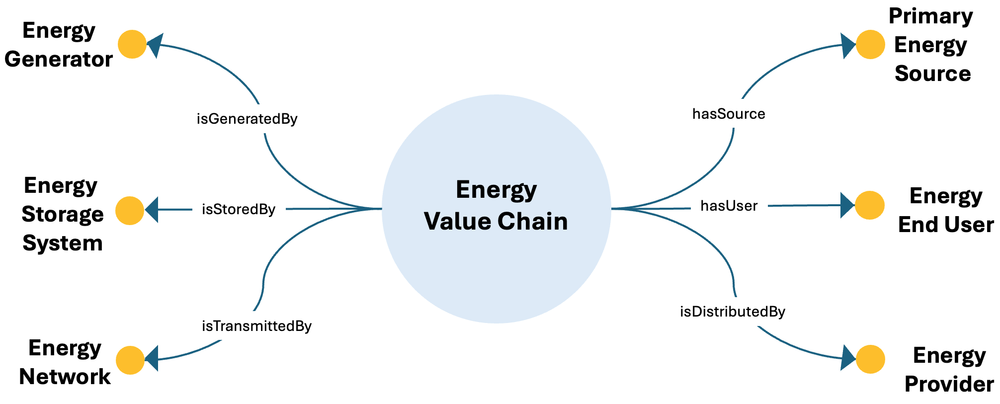

# Energy Value Chain ODP

## Description
The Energy Value Chain Ontology Design Pattern describes the main stages of the energy value chain, from primary sources and generation to transmission, storage, distribution, and end use.

This pattern provides a structured semantic representation that can be reused across the ESO catalog and linked to other patterns when modeling more complex energy-system dynamics.

---

## Conceptual Diagram

---

## Key Concepts

- **energy**: It represents the core entity moving through the value chain.
- **primary_energy_source**: It represents the original source of energy.
- **energy_generator**: It represents generation infrastructure.
- **energy_network**: It represents transmission infrastructure.
- **energy_storage_system**: It represents storage infrastructure.
- **energy_end_user**: It represents the final recipient of distributed energy.

---

## Interpretation
The pattern provides a compact representation of the stages through which energy flows from source to end user, making it suitable for modeling the operational logic of energy systems.

---

⬅️ [Back to the ODP Catalog](./)

