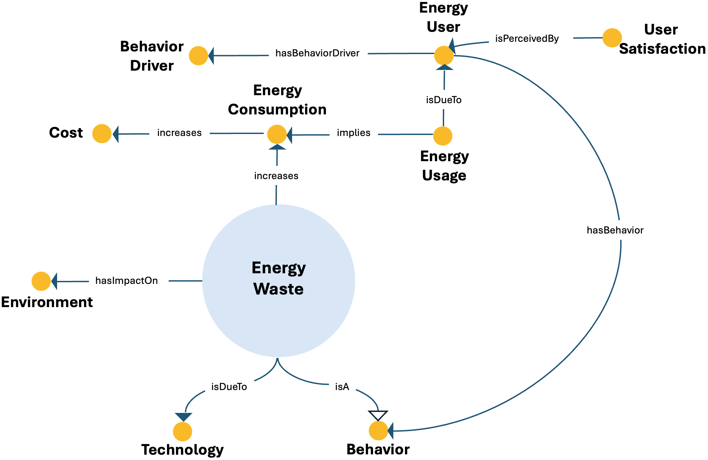

# Energy Waste ODP

## Description
The Energy Waste Ontology Design Pattern models the inefficient or unnecessary use of energy resources. It links wasteful behaviour to increased consumption, higher costs, and environmental impacts.

This pattern provides a structured semantic representation that can be reused across the ESO catalog and linked to other patterns when modeling more complex energy-system dynamics.

---

## Conceptual Diagram


---

## Formal OWL Excerpt

```turtle
@prefix eso:  <http://jerico.casaccia.enea.it/genesys/Energy-System-Ontology_v1.01#> .
@prefix owl:  <http://www.w3.org/2002/07/owl#> .
@prefix rdfs: <http://www.w3.org/2000/01/rdf-schema#> .

eso:energy_waste a owl:Class ;
    rdfs:label "energy waste" ;
    rdfs:subClassOf eso:behavior ;
    rdfs:subClassOf [ a owl:Restriction ; owl:onProperty eso:increases ; owl:someValuesFrom eso:energy_consumption ] ;
    rdfs:subClassOf [ a owl:Restriction ; owl:onProperty eso:hasImpactOn ; owl:someValuesFrom eso:environment ] ;
    rdfs:subClassOf [ a owl:Restriction ; owl:onProperty eso:isDueTo ; owl:someValuesFrom eso:technology ] .

eso:energy_usage a owl:Class ;
    rdfs:subClassOf [ a owl:Restriction ; owl:onProperty eso:implies ; owl:someValuesFrom eso:energy_consumption ] ;
    rdfs:subClassOf [ a owl:Restriction ; owl:onProperty eso:isDueTo ; owl:someValuesFrom eso:energy_user ] .

eso:energy_user a owl:Class ;
    rdfs:subClassOf [ a owl:Restriction ; owl:onProperty eso:hasBehavior ; owl:someValuesFrom eso:behavior ] ;
    rdfs:subClassOf [ a owl:Restriction ; owl:onProperty eso:hasBehaviorDriver ; owl:someValuesFrom eso:behavior_driver ] .

eso:user_satisfaction a owl:Class ;
    rdfs:subClassOf [ a owl:Restriction ; owl:onProperty eso:isPerceivedBy ; owl:someValuesFrom eso:energy_user ] .

eso:energy_consumption a owl:Class ;
    rdfs:subClassOf [ a owl:Restriction ; owl:onProperty eso:increases ; owl:someValuesFrom eso:cost ] .
```

---

## Related Classes and Properties

```turtle
@prefix eso:  <http://jerico.casaccia.enea.it/genesys/Energy-System-Ontology_v1.01#> .
@prefix owl:  <http://www.w3.org/2002/07/owl#> .

eso:energy_waste a owl:Class .
eso:behavior a owl:Class .
eso:energy_consumption a owl:Class .
eso:energy_usage a owl:Class .
eso:energy_user a owl:Class .
eso:user_satisfaction a owl:Class .
eso:environment a owl:Class .
eso:technology a owl:Class .
eso:behavior_driver a owl:Class .
eso:cost a owl:Class .

eso:increases a owl:ObjectProperty .
eso:hasImpactOn a owl:ObjectProperty .
eso:isDueTo a owl:ObjectProperty .
eso:implies a owl:ObjectProperty .
eso:hasBehavior a owl:ObjectProperty .
eso:hasBehaviorDriver a owl:ObjectProperty .
eso:isPerceivedBy a owl:ObjectProperty .
```

---

## Key Concepts

- **energy_waste**: It represents inefficient or unnecessary energy use.
- **energy_consumption**: It represents the process increased by wasteful behaviour.
- **technology**: It represents technological causes of waste.
- **behavior_driver**: It represents behavioural causes of waste.
- **cost**: It represents economic consequences associated with waste.

---

## Interpretation
The pattern is designed to show how wasteful practices can be traced to user behaviour and behavioural drivers, while also affecting costs and environmental conditions.

---

## Download
- [TTL file](../assets/rdf/energy-waste.ttl)
