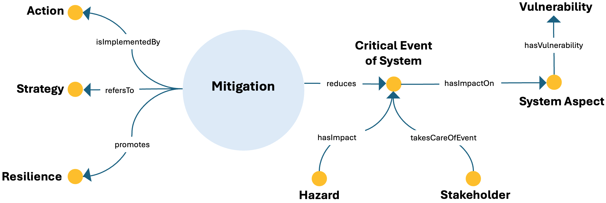

# Mitigation ODP

## Description

The Mitigation Ontology Design Pattern represents mitigation as a coordinated approach for reducing the occurrence or consequences of critical events affecting a system. It connects mitigation with the actions that implement it, the strategy to which it refers, and the resilience that it provides or promotes.

The pattern also describes the risk context in which mitigation operates. A hazard may have an impact on a critical system event, a stakeholder may take responsibility for that event, and the event may affect a system aspect characterized by a particular vulnerability.

By linking strategies, actions, hazards, critical events, system aspects, vulnerabilities, stakeholders, and resilience, the pattern supports a structured representation of how adverse events are anticipated, reduced, and managed within an energy system.

---

## Conceptual Diagram

---

## Key Concepts

### Core mitigation concepts

- **`mitigation`**: A set of measures intended to reduce the occurrence, severity, or consequences of a critical event. In ESO, this concept is imported from the TERMINUS upper ontology.
- **`action`**: A concrete intervention through which mitigation is implemented.
- **`strategy`**: A planned approach to which mitigation refers and within which individual actions can be coordinated.
- **`resilience`**: The ability of an individual, system, or community to withstand, adapt to, and recover from adversity or shocks while maintaining functionality and well-being.

### Hazards and critical events

- **`hazard`**: A potential source of danger or adverse consequences capable of contributing to a critical event. The ESO class is equivalent to `Hazard` in the TERMINUS upper ontology.
- **`critical_event_of_system`**: An event that can disrupt, damage, or otherwise significantly affect a system and whose occurrence or consequences mitigation seeks to reduce.

### Systems, vulnerabilities, and actors

- **`system_aspect`**: A specific component, property, function, or dimension of a system that may be affected by a critical event.
- **`vulnerability`**: The susceptibility of a system aspect to damage, disruption, or loss when exposed to a hazard or critical event.
- **`stakeholder`**: An actor with an interest, responsibility, or decision-making role in relation to the system and the management of critical events.

---

## Main Relationships

| Source concept | Relationship | Target concept |
|---|---|---|
| `mitigation` | `isImplementedBy` | `action` |
| `mitigation` | `refersTo` | `strategy` |
| `mitigation` | `provides` | `resilience` |
| `mitigation` | `reduces` | `critical_event_of_system` |
| `hazard` | `hasImpact` | `critical_event_of_system` |
| `stakeholder` | `takesCareOfEvent` | `critical_event_of_system` |
| `critical_event_of_system` | `hasImpactOn` | `system_aspect` |
| `system_aspect` | `hasVulnerability` | `vulnerability` |

---

## Interpretation

The pattern combines three complementary perspectives. First, it represents mitigation as a strategic construct implemented through concrete actions. Second, it captures the causal and impact chain connecting hazards, critical system events, affected system aspects, and vulnerabilities. Third, it introduces the governance and recovery dimensions by identifying the stakeholder responsible for addressing the event and the resilience supported by mitigation.

This structure makes the pattern suitable for competency questions concerning which actions implement mitigation, which strategy mitigation refers to, which critical events it reduces, which hazards and vulnerabilities are involved, and which stakeholders are responsible for event management.

---
⬅️ [Back to the ODP Catalog](./)

