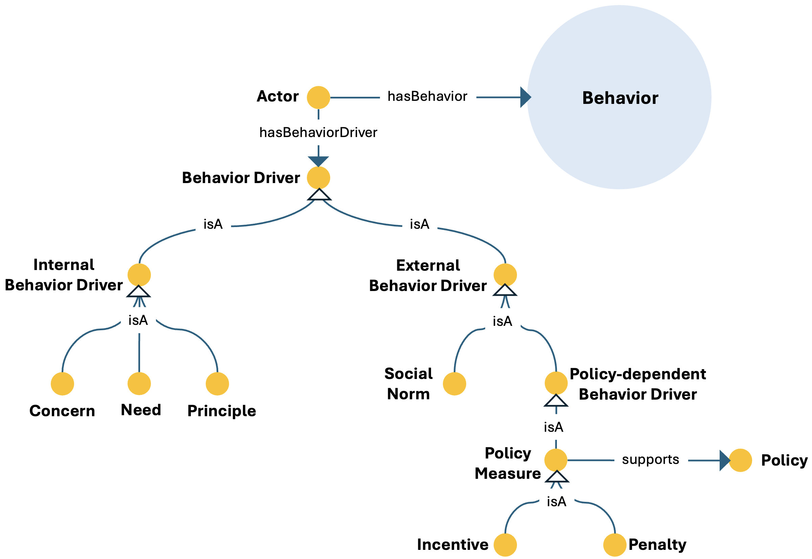

# Policy Acceptance ODP

## Description
The Policy Acceptance Ontology Design Pattern models the degree to which actors support or comply with policies, linking acceptance to behavioural dynamics and to internal and external behaviour drivers.

This pattern provides a structured semantic representation that can be reused across the ESO catalog and linked to other patterns when modeling more complex energy-system dynamics.

---

## Conceptual Diagram


---

## Formal OWL Excerpt

```turtle
@prefix eso:  <http://jerico.casaccia.enea.it/genesys/Energy-System-Ontology_v1.01#> .
@prefix owl:  <http://www.w3.org/2002/07/owl#> .
@prefix rdfs: <http://www.w3.org/2000/01/rdf-schema#> .


eso:actor a owl:Class ;
    rdfs:subClassOf [ a owl:Restriction ; owl:onProperty eso:hasBehavior ; owl:someValuesFrom eso:behavior ] ;
    rdfs:subClassOf [ a owl:Restriction ; owl:onProperty eso:hasBehaviorDriver ; owl:someValuesFrom eso:behavior_driver ] .

eso:policy_measure a owl:Class ;
    rdfs:subClassOf [ a owl:Restriction ; owl:onProperty eso:supports ; owl:someValuesFrom eso:policy ] .
```

---

## Related Classes and Properties

```turtle
@prefix eso:  <http://jerico.casaccia.enea.it/genesys/Energy-System-Ontology_v1.01#> .
@prefix owl:  <http://www.w3.org/2002/07/owl#> .
@prefix rdfs: <http://www.w3.org/2000/01/rdf-schema#> .

eso:actor a owl:Class .
eso:behavior a owl:Class .
eso:behavior_driver a owl:Class .
eso:concern a owl:Class .
eso:external_behavior_driver a owl:Class .
eso:incentive a owl:Class .
eso:internal_behavior_driver a owl:Class .
eso:need a owl:Class .
eso:policy-dependent_behavior_driver
eso:principle a owl:Class .
eso:penalty a owl:Class .
eso:policy a owl:Class .
eso:policy_measure a owl:Class .
eso:social_norm

eso:hasBehavior a owl:ObjectProperty .
eso:hasBehaviorDriver a owl:ObjectProperty .
eso:supports a owl:ObjectProperty .
```

---

## Key Concepts

- **policy_acceptance**: It represents support for or compliance with a policy.
- **actor**: It represents the actor whose behaviour shapes acceptance.
- **behavior**: It represents behaviour associated with support or compliance.
- **internal_behavior_driver**: It represents internal factors influencing behaviour.
- **external_behavior_driver**: It represents contextual or external drivers influencing behaviour.

---

## Interpretation
The pattern makes it possible to connect policy support and compliance to user behaviour, behaviour drivers, and policy support measures, which is especially relevant in transition governance and social acceptance studies.

---

## Download
- [TTL file](../assets/rdf/policy-acceptance.ttl)
