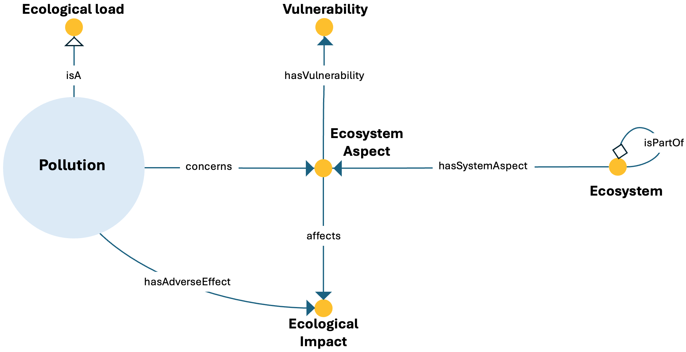

# Pollution ODP

## Description
The Pollution Ontology Design Pattern represents pollution as an environmental pressure generated by energy systems, linking pollutant sources to ecosystem aspects and ecological impacts.

This pattern provides a structured semantic representation that can be reused across the ESO catalog and linked to other patterns when modeling more complex energy-system dynamics.

---

## Conceptual Diagram


---

## Formal OWL Excerpt

```turtle
@prefix eso:  <http://jerico.casaccia.enea.it/genesys/Energy-System-Ontology_v1.01#> .
@prefix owl:  <http://www.w3.org/2002/07/owl#> .
@prefix rdfs: <http://www.w3.org/2000/01/rdf-schema#> .

eso:pollution a owl:Class ;
    rdfs:label "pollution" ;
    rdfs:subClassOf eso:ecological_load ;
    rdfs:subClassOf [ a owl:Restriction ; owl:onProperty eso:concerns ; owl:someValuesFrom eso:ecosystem_aspect ] ;
    rdfs:subClassOf [ a owl:Restriction ; owl:onProperty eso:hasAdverseEffect ; owl:someValuesFrom eso:ecological_impact ] .

eso:ecosystem a owl:Class ;
    rdfs:subClassOf [ a owl:Restriction ; owl:onProperty eso:isPartOf ; owl:someValuesFrom eso:ecosystem ] ;
    rdfs:subClassOf [ a owl:Restriction ; owl:onProperty eso:hasSystemAspect ; owl:someValuesFrom eso:ecosystem_aspect ] .

eso:ecosystem_aspect a owl:Class ;
    rdfs:subClassOf [ a owl:Restriction ; owl:onProperty eso:hasVulnerability ; owl:someValuesFrom eso:vulnerability ] ;
    rdfs:subClassOf [ a owl:Restriction ; owl:onProperty eso:affects ; owl:someValuesFrom eso:ecological_impact ] .
```

---

## Related Classes and Properties

```turtle
@prefix eso:  <http://jerico.casaccia.enea.it/genesys/Energy-System-Ontology_v1.01#> .
@prefix owl:  <http://www.w3.org/2002/07/owl#> .

eso:pollution a owl:Class .
eso:ecological_load a owl:Class .
eso:ecosystem_aspect a owl:Class .
eso:ecological_impact a owl:Class .
eso:ecosystem a owl:Class .
eso:vulnerability a owl:Class .

eso:concerns a owl:ObjectProperty .
eso:hasAdverseEffect a owl:ObjectProperty .
eso:hasSystemAspect a owl:ObjectProperty .
eso:hasVulnerability a owl:ObjectProperty .
eso:affects a owl:ObjectProperty .
```

---

## Key Concepts

- **pollution**: It represents an ecological load affecting ecosystems.
- **ecosystem_aspect**: It represents the ecosystem component concerned by pollution.
- **ecological_impact**: It represents the adverse effects associated with pollution.
- **vulnerability**: It represents susceptibility within the ecosystem.

---

## Interpretation
The pattern frames pollution as an ecological load that affects ecosystems and their components. It supports the integration of environmental impacts into a broader energy-system ontology.

---

## Download
- [TTL file](../assets/rdf/pollution.ttl)
