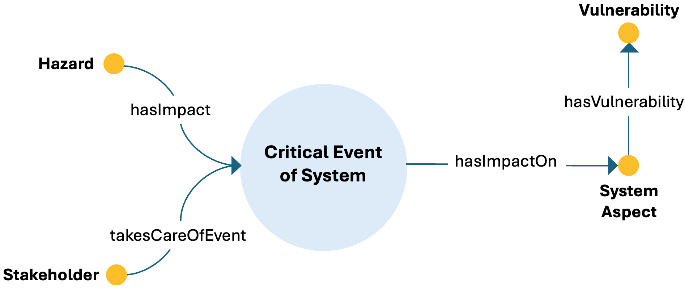

# Risk ODP

## Description
The Risk Ontology Design Pattern [1] represents critical events affecting system aspects from the perspective of stakeholders, with particular attention to hazards and vulnerabilities.

This pattern provides a structured semantic representation that can be reused across the ESO catalog and linked to other patterns when modeling more complex energy-system dynamics.

---

## Conceptual Diagram

---

## Key Concepts

- **critical_event_of_system**: It represents an event affecting a system.
- **system_aspect**: It represents the aspect of the system affected by an event.
- **hazard**: It represents the source of potential harm.
- **vulnerability**: It represents the susceptibility of the affected aspect.
- **stakeholder**: It represents the actor concerned with the event.

---

## Interpretation
The pattern provides a semantic structure for describing events, their impacts on system aspects, and the vulnerabilities that mediate these impacts. It is especially useful for resilience and crisis-oriented analyses.

---

## References
[1] A. De Nicola, M. L. Villani, Actionable semantic patterns in the crisis management lifecycle: The TERMINUS ontology, Smart Cities 8 (5)
(2025). doi:10.3390/smartcities8050179.
