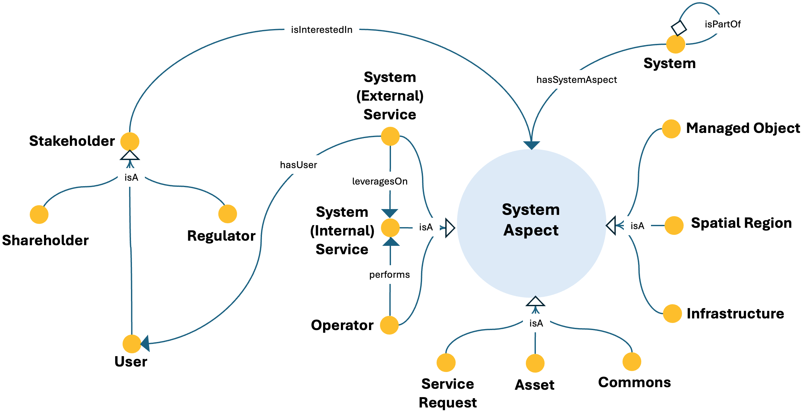

# System Aspect ODP

## Description
The System Aspect Ontology Design Pattern [1] provides a general pattern for representing the perspectives from which a system can be described, such as services, operations, operators, assets, infrastructures, commons, spatial regions, and managed objects.

This pattern provides a structured semantic representation that can be reused across the ESO catalog and linked to other patterns when modeling more complex energy-system dynamics.

---

## Conceptual Diagram


---

## Formal OWL Excerpt

```turtle
@prefix eso:  <http://jerico.casaccia.enea.it/genesys/Energy-System-Ontology_v1.01#> .
@prefix owl:  <http://www.w3.org/2002/07/owl#> .
@prefix rdfs: <http://www.w3.org/2000/01/rdf-schema#> .

eso:system a owl:Class ;
    rdfs:label "system" ;
    rdfs:subClassOf [ a owl:Restriction ; owl:onProperty eso:hasSystemAspect ; owl:someValuesFrom eso:system_aspect ] .
    rdfs:subClassOf [ a owl:Restriction ; owl:onProperty eso:isPartOf ; owl:someValuesFrom eso:system ] .

eso:system_internal_service a owl:Class ;
    rdfs:subClassOf eso:system_aspect .

eso:service_request a owl:Class ;
    rdfs:subClassOf eso:system_aspect .

eso:asset a owl:Class ;
    rdfs:subClassOf eso:system_aspect .

eso:commons a owl:Class ;
    rdfs:subClassOf eso:system_aspect .

eso:infrastructure a owl:Class ;
    rdfs:subClassOf eso:system_aspect .

eso:managed_object a owl:Class ;
    rdfs:subClassOf eso:system_aspect .

eso:spatial_region a owl:Class ;
    rdfs:subClassOf eso:system_aspect .

eso:system_external_service a owl:Class ;
    rdfs:subClassOf [ a owl:Restriction ; owl:onProperty eso:hasUser ; owl:someValuesFrom eso:user ] ;
    rdfs:subClassOf [ a owl:Restriction ; owl:onProperty eso:leveragesOn ; owl:someValuesFrom eso:system_internal_service ] .

eso:operator a owl:Class ;
    rdfs:subClassOf [ a owl:Restriction ; owl:onProperty eso:performs ; owl:someValuesFrom eso:system_internal_service ] .

eso:stakeholder a owl:Class ;
    rdfs:subClassOf [ a owl:Restriction ; owl:onProperty eso:isInterestedIn ; owl:someValuesFrom eso:system_aspect ] .

eso:shareholder a owl:Class ;
    rdfs:subClassOf eso:stakeholder .

eso:regulator a owl:Class ;
    rdfs:subClassOf eso:stakeholder .

eso:user a owl:Class ;
    rdfs:subClassOf eso:stakeholder .
```

---

## Related Classes and Properties

```turtle
@prefix eso:  <http://jerico.casaccia.enea.it/genesys/Energy-System-Ontology_v1.01#> .
@prefix owl:  <http://www.w3.org/2002/07/owl#> .

eso:system a owl:Class .
eso:system_aspect a owl:Class .
eso:system_external_service a owl:Class .
eso:system_internal_service a owl:Class .
eso:operator a owl:Class .
eso:service_request a owl:Class .
eso:asset a owl:Class .
eso:commons a owl:Class .
eso:infrastructure a owl:Class .
eso:managed_object a owl:Class .
eso:spatial_region a owl:Class .
eso:stakeholder a owl:Class .
eso:shareholder a owl:Class .
eso:regulator a owl:Class .
eso:user a owl:Class .

eso:hasSystemAspect a owl:ObjectProperty .
eso:isInterestedIn a owl:ObjectProperty .
eso:hasUser a owl:ObjectProperty .
eso:isPartOf a owl:ObjectProperty .
eso:leveragesOn a owl:ObjectProperty .
eso:performs a owl:ObjectProperty .
```

---

## Key Concepts

- **system**: It represents a system described through multiple aspects.
- **system_external_service**: It represents services delivered by the system.
- **system_internal_operation**: It represents operations carried out within the system.
- **asset**: It represents valuable resources or items owned by the system.
- **infrastructure**: It represents infrastructural components of the system.
- **managed_object**: It represents the object handled by the system.

---

## Interpretation
The pattern supports a multi-perspective description of systems and enables the modular representation of operational, infrastructural, social, and service-oriented aspects.

---

## Download
- [TTL file](../assets/rdf/system-aspect.ttl)

---

## References
[1] A. De Nicola, M. L. Villani, Actionable semantic patterns in the crisis management lifecycle: The TERMINUS ontology, Smart Cities 8 (5)
(2025). doi:10.3390/smartcities8050179.

